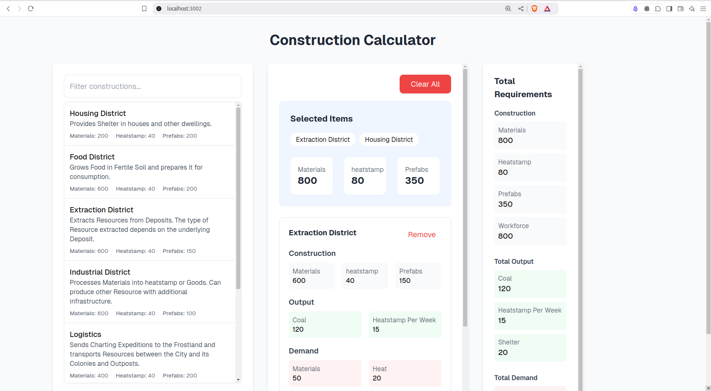

# Construction Calculator

A calculator for Frostpunk 2 construction resources.

## Getting Started

### Development

Run the development server:

```bash
npm run dev
```

Open [http://localhost:3000](http://localhost:3000) with your browser to see the result.

### Docker

Build and run with Docker:

```bash
# Build the Docker image
docker build -t construction-calculator .

# Run the container
docker run -p 3002:3000 construction-calculator
```

Open [http://localhost:3002](http://localhost:3002) with your browser to see the result.

## Features

- Calculate total construction requirements
- Search and add multiple buildings
- View resource demands and outputs
- Clear all selections



## Learn More

This is a [Next.js](https://nextjs.org/) project bootstrapped with [`create-next-app`](https://nextjs.org/docs/getting-started).

To learn more about Next.js, take a look at:
- [Next.js Documentation](https://nextjs.org/docs)
- [Learn Next.js](https://nextjs.org/learn)
